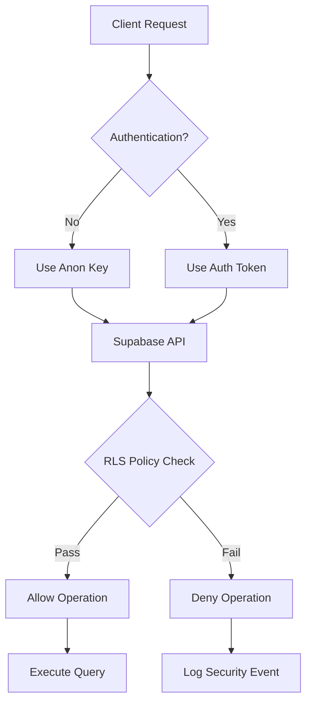

# Security Insights for MVOPlatform Early-Stage Production Deployment

## Index

- [Introduction](#introduction)
- [Supabase Security Analysis](#supabase-security-analysis)
- [Other Security Considerations](#other-security-considerations)
- [Recommendations](#recommendations)
- [Conclusion: Is a Security Effort Worth It?](#conclusion-is-a-security-effort-worth-it)

## Introduction

When we are preparing to deploy our early-stage product to production we might have a critical question: "Is a security effort worth it?" Talking primarily about the MVO Platform, where we focus on our Next.js application backend by Supabase, examining connection security, Row Level Security (RLS) policies, and other configurations, our goal is to identify potential risks, understand their causes, and decide if investing time and resources in security measures is justified before launch.

I recognize that early-stage products often prioritize speed over security, but overlooking vulnerabilities can lead to data breaches, user distrust, and costly fixes later. By analyzing our current setup, we aim to balance innovation with protection, ensuring MVO Platform's user-generated content and community features remain safe.

## Supabase Security Analysis

Supabase is our core backend, handling authentication, database operations, and storage. We initialize the client with the Supabase URL and an anonymous (anon) key, which is exposed in our client-side code. This key enables unauthenticated access to specific operations, with security enforced through RLS policies.

### How the Anon Key Works

The anon key acts as a public API token, allowing read/write access based on RLS rules without full authentication. For example:

- Unauthenticated users can browse public ideas and comments.
- Creating or editing content requires login, generating an auth token.

This setup promotes accessibility but exposes the key in browser code, making it visible to anyone inspecting the app. Unlike a database password, the anon key is scoped to API calls, limiting direct database access. However, misuse could allow unauthorized operations if policies fail.

### RLS Policies and Their Role

We have enabled RLS on all tables, with policies controlling access per user context. Key examples from our schema:

- **Users Table**: Users can view/edit their own profiles; public access for non-anonymous idea creators.
- **Ideas Table**: Public read access; authenticated users can create; creators can update.
- **Comments Table**: Public read; authenticated insert; users edit their own.

These policies prevent infiltration by filtering data at the database level. For instance, even with the anon key, an attacker cannot delete others' ideas without proper authentication and policy allowance.

### Potential Risks and Causes

Despite safeguards, risks persist:

- **Policy Misconfiguration**: Incorrect RLS rules could allow unintended access. Cause: Human error during schema updates.
- **Anon Key Compromise**: If leaked (e.g., via browser logs), attackers might exploit public operations. Cause: Client-side exposure inherent to Supabase's design.
- **Denial of Service**: Excessive unauthenticated queries could overload the database. Cause: Lack of rate limiting on public endpoints.
- **Data Leakage**: Sensitive user data might be exposed if policies don't account for all scenarios. Cause: Incomplete policy coverage for complex queries.

| Risk Category       | Potential Impact   | Mitigation in Place   | Additional Needed |
| ------------------- | ------------------ | --------------------- | ----------------- |
| Unauthorized Access | Data manipulation  | RLS policies          | Policy audits     |
| Key Exposure        | API abuse          | Scoped key            | Monitoring tools  |
| Performance Attacks | Service disruption | Supabase limits       | Rate limiting     |
| Injection Attacks   | Code execution     | Parameterized queries | Input validation  |

## Other Security Considerations

Beyond Supabase, several aspects of our Next.js setup and application logic warrant attention.

### Remote Patterns for Media Loading

Our `next.config.js` uses `remotePatterns` to allow images and videos from any HTTPS domain, supporting user freedom in media links. This is ideal for MVOPlatform's creative community, where users might embed content from various sources.

However, this introduces risks:

- **Malicious Content Loading**: Users could link to harmful images/videos, potentially executing scripts or phishing.
- **External Threats**: Domains might host malware, exposing users via drive-by downloads.
- **Performance Issues**: Unrestricted loading could lead to slow page loads or bandwidth abuse.

Mitigations include Next.js's automatic sanitization and HTTPS enforcement, but we should consider:

1. User education on safe linking.
2. Optional domain whitelisting for premium users.
3. Monitoring for suspicious links.

### Environment Variables and Key Management

Sensitive keys like the anon key are in client-accessible environment variables. This is necessary for Supabase client initialization but risky if leaked.

- **Exposure Causes**: Keys visible in source code or network requests.
- **Impacts**: API abuse or data theft.
- **Mitigations**: We use template files for secrets; in production, ensure proper secret management and rotate keys regularly.

### User-Generated Content and Input Validation

oUR MVO Platform handles rich content like ideas and comments, which could introduce:

- **Injection Risks**: If not sanitized, malicious scripts could execute.
- **XSS Vulnerabilities**: Unescaped HTML in comments.

We rely on Supabase's query safety and Next.js rendering, but should add:

- Client-side input sanitization.
- Server-side validation for content types.
- Content moderation tools.

### Additional Considerations

- **HTTPS Enforcement**: All traffic must be secure; we configure Next.js accordingly.
- **Authentication Flows**: OAuth via Supabase; ensure secure token handling.
- **Logging and Monitoring**: Implement error tracking to detect anomalies.

## Recommendations

Based on our analysis, we recommend the following prioritized actions:

1. **Audit RLS Policies**: Review all policies for completeness; test edge cases.
2. **Implement Monitoring**: Use tools like Supabase logs or Sentry for security events.
3. **Add Rate Limiting**: Prevent abuse on public endpoints.
4. **Enhance Input Validation**: Sanitize all user inputs before database insertion.
5. **Key Rotation Plan**: Regularly (Once every 3 months) update anon and service keys.
6. **User Education**: Guide users on secure content sharing.

## Conclusion: Is a Security Effort Worth It?

Absolutely, investing in security for MVO Platform at this early stage is worth it. While our current RLS and Supabase setup provides a strong baseline, preventing catastrophic breaches, the identified risks—such as policy flaws or key exposure—could undermine user trust and growth if unaddressed. Early efforts like policy audits and monitoring are low-cost and high-impact, allowing us to iterate quickly without sacrificing safety.

Pros of investing now:

- Builds user confidence in our platform.
- Reduces future remediation costs.
- Aligns with best practices for user-facing apps.

Cons:

- Slight delay in deployment timeline.
- Resource allocation from feature development.

Overall, the benefits outweigh the drawbacks. By treating security as a core feature, we position the MVO Platform for sustainable success in production.
